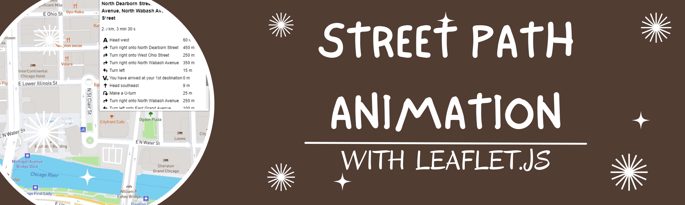
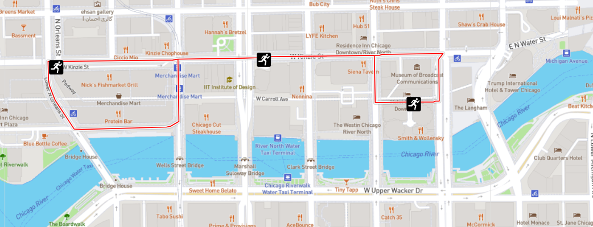

# leaflet-street-animation

Author:  Erin James Wills, ejw.data@gmail.com  

  
<cite>Photo by Erin Wills</cite>  

 

## Overview

Below is a quick example of a leaflet animation where I incorporate the browser's built-in geolocation as a starting location and using the click event on the map to assign the ending location.  The animation moves the starting marker along a generated street path until it reaches the end location.  The path directions are also displayed in the upper right section of the map.    

**`Future Work`**:  This test case was developed for a potential rideshare and bikeshare analysis that would incorporate an interactive map to visualize vehicle activity and scheduling. 

   

## Github Pages  

https://ejw-data.github.io/leaflet-street-animation/index.html   

 

## Technologies    
*  HTML/CSS/JS
*  Leaflet.js

 

## Data Source  

Not applicable  

 

## Setup and Installation  
1. Clone the repo to your local machine
1. Open repo folder in an IDE like VSCode
1. Using a virtual server like the VSCode extention LiveServer
1. Run `index.html`  

 

## Example

<figure>

  
<figcaption>Fig.1 - Path drawn by the Leaflet animation plugin</figcaption>
</figure>